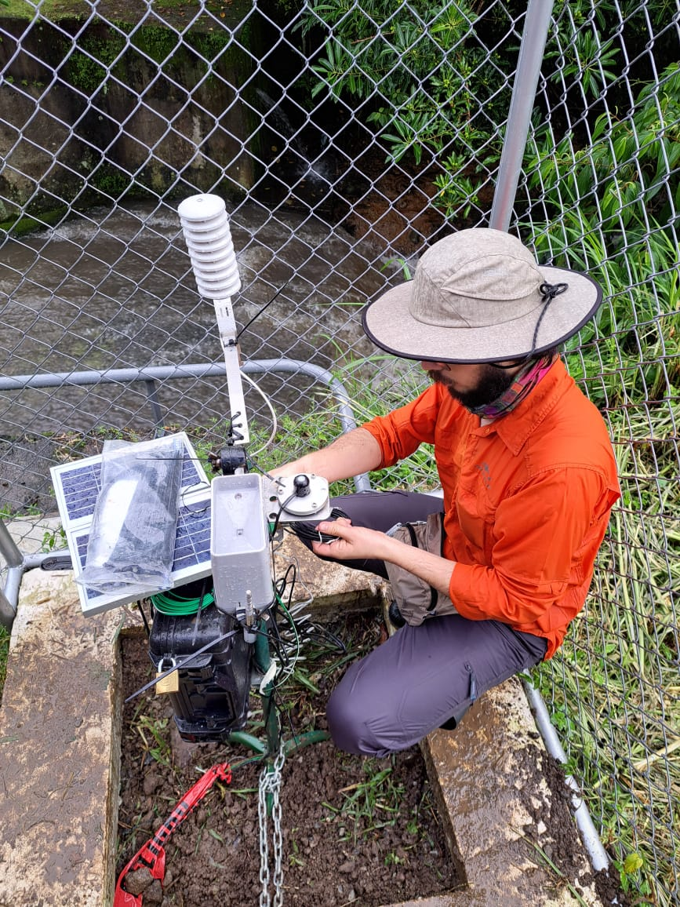

# Formación

* Bachiller en Geografía, 2020.
    
* Licenciatura en trámite.
    
* Maestría en trámite.
    

## **Nombre** : Manfred Salas Castro

## **Profesión** : *Geógrafo*

## Áreas de interés
1. Gestión de riesgos  
2. Gestión del recurso hídrico

## Cursos de especialización
- GRD
- Cartografía geomorfológica
- Morfometría

## Experiencia laboral 
### [Consultor para el Proyecto (KNOW) Conocimiento en Acción para la Equidad Urbana](https://www.urbantransformations.ox.ac.uk/project/knowledge-in-action-for-urban-equality-know/#:~:text=Knowledge%20in%20Action%20for%20Urban%20Equality%20(KNOW)%20is%20a%20response,transformative%20research%2C%20and%20capacity%20building.)
### Experiencia académica
* Asistente 2019 - 2021, para el proyecto ED-3319 Observatorio del Agua y Cambio Global (OACG), de la Escuela de Geografía UCR.
Funciones: Investigación en hidrología, climatología y eco-hidrología urbana.
* Asistente en II ciclo 2020-2021 para el proyecto C0074, Oscilación Antártica: Su influencia en la precipitación en Mesoamérica, del Centro de Investigaciones Geofísicas (CIGEFI) UCR.
Funciones: Elaborar y diseñar cartografía temática en climatología y meteorología.
* Asistente en II ciclo 2019 para el Programa de investigación en gestión territorial y procesos socio-ambientales. (B6904), Escuela de Geografía UCR.
Funciones: Trámites administrativos, tabulaciones y asistencia en la elaboración de informes.
* Asistente en el III ciclo 2018, del Trabajo Comunal Universitario (TCU) TC-596 “Apoyo a la gestión local comunitaria” Territorio indígena Boruca. Escuela de Geografía, UCR.
Funciones: Trámites administrativos, apoyo de logística para el planeamiento de trabajo de campo en territorio indígena Boruca.
* Asistente en el II ciclo 2018, para el proyecto: ED-3317 “Construyendo la gestión local del riesgo, desde la comunidad de Rincón de Alpízar. Sarchí, Costa Rica”
Funciones: Elaboración de talleres de cartografía participativa para comunidades con el objetivo de conocer la valoración y percepción de la población ante amenazas y riegos en la zona.
* Asistente en el I ciclo 2018. Para los cursos GF-0215, Cartografía Básica GF-0317 Investigación Geográfica.
Funciones: Instructor de laboratorio de Sistemas de Información Geográfica (SIG).

## Contacto   
### [Perfil de LinkeDin](https://cr.linkedin.com/in/manfredsalascastro)

